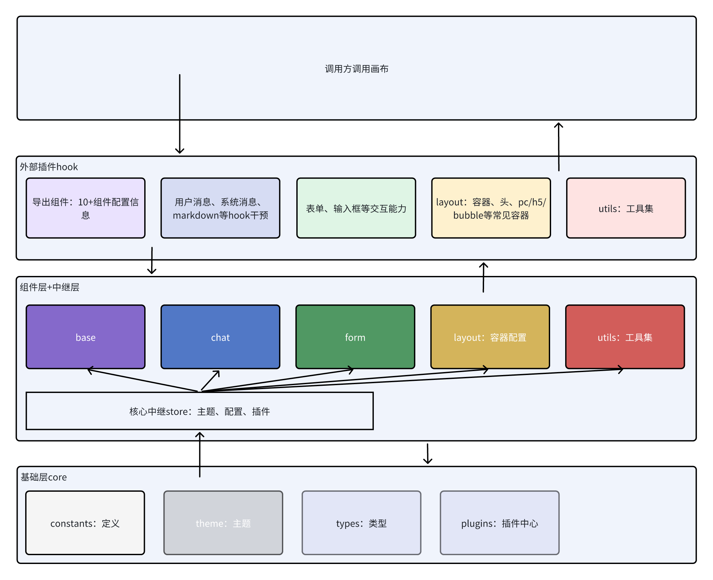

## 🎯 背景
一个快速构建对话助手的前端组件库，但它更像是一个轻量的解决方案

## 展示
## ✨ 特性
🧩 **单容器即用**：无需嵌套多层组件，一个容器覆盖全部场景，接入成本降低 80%  
⚙️ **配置驱动**：所有交互、样式、文案均通过 JSON 配置完成，支持热更新  
📡 **事件丰富**：统一 emits 输出/属性函数，轻松对接状态管理或业务逻辑  
🌓 **插槽灵活**：关键节点提供同名插槽，既保留自由度又保持 API 简洁  
🎉 **主题配置**：高度灵活自由定制的JSON化样式配置, 支持柯里化样式调整  
📦 每个组件可单独引入，Tree-Shaking 零依赖  
🔧 完全 TypeScript，智能提示友好  
## 📖 文档
完整文档与实时 Demo 请访问：建设中...  
### 🎨 配置概览

| props名称            | 是否必填 | 说明                                           | 详细信息                                   |
| -------------------- | -------- | ---------------------------------------------- | ------------------------------------------ |
| mode                 | 否       | 用于设置Chat组件展示模式（包括PC、H5、Bubble） | -         |
| conversations        | 否       | 用于设置历史会话列表                           |-          |
| conversationId       | 否       | 用于设置当前选中的会话id                       | -  |
| messageList          | 否       | 用于设置当前会话的历史消息列表                 | -        |
| chatConfig           | 否       | 用于设置Chat内部各组件                         | -     |
| draggable            | 否       | 用于设置Chat是否开启可拖拽                     | -         |
| draggableOptions     | 否       | 用于设置Chat开启可拖拽后的具体配置参数         | -   |
| bubbleOptions        | 否       | 用于设置Chat设置mode为`bubble`后，按钮配置信息 | -    |
| onSendMsg            | 是       | 发送消息时调用                                 | -       |
| onStopMsg            | 是       | 停止消息时调用                                 | -        |
| onUploadFiles        | 是       | 上传文件时调用                                 |-    |
| onSwitchConversation | 是       | 切换会话时调用                                 |-|
| onAddConversation    | 是       | 新建会话时调用                                 | -   |
| onDeleteConversation | 是       | 删除会话时调用                                 | - |
| onUpdateConversation | 是       | 更新会话时调用                                 |- |
| slots                | 否       | 自定义展示位配置                               |-|

## 🚀 快速开始
### @ms-chat/react · Quick Start
一行命令启动聊天组件，3 分钟接入你的业务接口。  
1. 安装
```bash
npm i @ms-chat/react
```
2. 最小可运行示例  
```TypeScript
    # 问答换成「你自己的接口」 pushMessage保持id相同会触发消息更新
    const _sendMsg = (msg: string, isActive: boolean) => {
      msChatRef.current.pushMessage({
        id: contentId,
        type: 'markdown',
        content: msg,
        role: 'system',
        isStream: true,
        isActive: !!isActive
      });
    };
    const sendMsgThrottle = throttle(_sendMsg, 30);
    const sse = new EventSourceService<{ message: string }>();
        sse.connect({
            url: '你的/stream/chat',          // ← 换成真实端点
            headers: { 'x-token': 'xxx' },    // ← 鉴权
            body: { query: msg, userId: 123 },
            method: 'POST'
        }, {
            onMessage: (ev) => {
                const chunk = ev.choices?.[0]?.delta?.content || '';
                resContent += chunk;
                sendMsgThrottle(resContent, true);
            },
            onClose: () => {
                sendMsgThrottle(resContent, false)
            }
        });
        interface MainProps {
            mode: 'h5' | 'pc' | 'bubble';
        }
        const Main: React.FC<MainProps> = ({ mode }) => {
          return (
                <MSChat
                  ref={msChatRef}
                  mode={mode}
                  onSendMsg={sendMsg}
                 />
          )
        };
```
4. 常用二次开发入口  

| 需求          | 改哪里                                                                          |
| ----------- | ---------------------------------------------------------------------------- |
| 替换头像、名称     | `chatConfig.bubble.left / right`                                             |
| 隐藏上传按钮      | `chatConfig.sender.options.enableUpload = false`                             |
| 自定义欢迎语      | `initWelcome()` 里把 `res.data` 换成你的静态 JSON                                    |
| 新增会话、删除、重命名 | 已内置 `onAddConversation / onDeleteConversation / onUpdateConversation`，直接调用即可 |
| 插入卡片/按钮     | `slots.bubbleCardExt = (props) => <YourCard {...props} />` |

Done！现在你已经拥有：  
✅ 会话列表  
✅ 流式对话  
✅ 文件上传  
✅ 多端模式（PC / H5 / 气泡）  
快去改造 sendMsg 和后端接起来，属于你的 AI对话应用就ready了  
## 🔨 本地开发  
请确保开发此项目时，本地安装了node16的运行环境，并且建议使用pnpm@8作为包管理工具。  
本项目整体使用monorepo架构进行开发，子包在packages目录下：  
core：包含图表组件中与框架（react、vue）无关的公用函数、ts类型定义等   vue: 包含vue框架使用的基础组件   react：包含react框架使用的基础组件  
目标是react、vue尽量保持api一致，并且能复用的内容尽量抽离到core包中复用  
进入react、vue-next项目中 查看demo文件即可。  


## 😄 开发群
企业微信：xxx